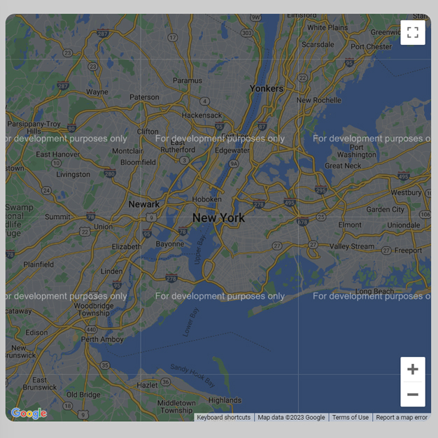

# Day #32

### Google Maps
In this tutorial ([Open in Facebook](https://www.facebook.com/Kira2k7)),  I am gonna showing to you how to use google maps api in javascript. we create a project that you can work with google map in javascript❗️Also this project is full responsive!

# Screenshot
Here we have project screenshot :

